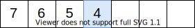
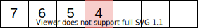
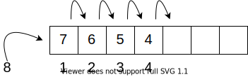
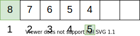
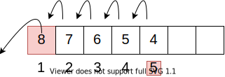
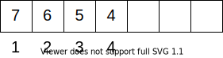
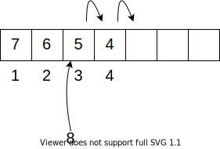
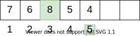
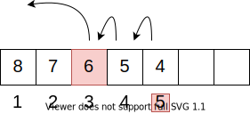
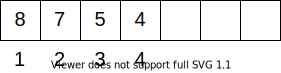

# A Short Introduction to the Array Data Structure

> This isn't an original explanation, but is rather based on my understanding of this [video](https://www.coursera.org/lecture/data-structures/arrays-OsBSF) on Coursera. I found it to be a very good introduction to the topic, and I thought I might summarize it to make sure I have understood the subject matter. Maybe it might be useful for someone else out there.


Arrays are ubiquitous in computer science, and it's important to get a basic understanding of how the array works as a data structure. It will form a foundation for understanding the linked list in the next article.

An array is defined as a contiguous area of memory consisting of equal sized elements indexed by contiguous integers. The array below shows this visually:


Let's unpack that statement and see what it means...

- **"contiguous area of memory"** : That means it occupies a continuous area of memory, with the memory locations in sequence.

- **"equal sized elements"** : That means each element is allocated the same size of memory, whatever that may be.

- **"indexed by contiguous integers"** : That means that the references to the elements of the array are a sequential set of integers. In the above example, we start with `1` and then count up from there. Many of the most popular programming languages start counting from `0`, and there are some that allow you to choose what number to start from. From my understanding, it doesn't matter. You could start at negative `-533` if you wanted. The important thing is that you have sequential integers; something like `-533, -530, -243` is a big no-no.


The interesting thing about an array is that it offers constant time access. That's constant time access to both read and write from the array. How is this possible? Well, every time you want to access an element, all it takes is a simple arithmetic calculation, which means it will take the same amount of time to execute no matter how large the array or what element you're trying to access. 

So how is this possible? Well, accessing any element involves the following mathematical operation:


- The variable `ArrayAddress` stands for the address in memory that begins with.
- `ElementSize` stands for the memory size of each element. The only reason why this equation works, by the way, is that each element is allocated the same amount of memory, hence our "equal sized elements" constraint in our definition of an array.
- `i` is the index of interest. If we're trying to access the third element of the array, `i` might be either **3** or **2**, depending on whether we're using zero-based or one-based indexing.
- `FirstIndex` is the first index of the array. If we're using zero-based indexing, that's **0**. If we're using one-based indexing it's **1**.

So to access an element, we only need to know its index, the memory location where the array starts, and the size of each element. This makes the array a powerful construct, since it means we can access any element with no more than a simple arithmetic calculation.

Say, for example, that we have a 2D array and we want to access a particular element...


In this case, we want to access the 4th element in the third row, denoted by the coordinates `(3,4)` in this case. The first element in such an arrangement would have the coordinates `(1,1)`.

So how do we access the address of the 4th element in the third row?

According to our formula above, we would first need to find the index of our element. Since it is in the third row, it is ahead of 2 rows. Each row has 6 elements so that's `(3-1) * 6`, or 12 elements.

Also, it is the 4th element of the third row, so we add another 4 to 12 to find that its index is 16.

Now, applying our formula...

```
element_address = array_address + element_size * (i - first_index)

element_address = array_address + element_size * (16 - 1)

```

Of course we're assuming an array where the first index is 1, though it could also just as easily be zero. Of course, the array_address can vary, and so can element_size, but the formula remains immutable so all you have to do is plug the values in.


## Time Complexity for Array Operations

|   | **Add** | **Remove** |
|---|---------|  ----------|
| Beginning | `O(n)` | `O(n)` |
| End | `O(1)` | `O(1)` |
| Middle | `O(n)` | `O(n)` |

Adding an element at the end of the array is as simple as updating the value of the address right after the last value of the array and then updating the number of elements in the array. This operation takes the same amount of time no matter what the size of the array, and so is `O(1)` operation, read as "order-1" or "Big O of 1".



Removing an element from the end of the array is also as simple as deleting it and updating the number of elements of the array, which happens in constant time no matter how large the array.



Things get interesting when we're adding and deleting at the beginning and middle.

When adding to the beginning of an array, updating the number of elements to the array will happen in constant time, just like it does when adding to the end. However, we will also have to shift each of the other elements in the array to the right and update their indices. 





The time it takes to do this will increase with the number of elements `n` that our array has, making an `O(n)` operation.

The same applies when we want to remove an element from the beginning. We have to remove it, shift the other elements to the left, and then update the number of elements in our array.






Again, the same applies when you add or remove an element in the middle. Removing requires a left shift of the elements that come after the element, and adding requires a right shift of the elements that come after it. The amount of time it takes to do this depends on the number of elements after the element of interest, which in turn depends on the number of elements in the array, making it an `O(n)` operation. Adding and removing elements in an array are really just a more general form, where the extreme special case is adding or removing an element from the beginning of the array.


**Adding to the middle**






**Removing from the middle**








That said, the biggest advantage for the array is that you have constant time access to both read and write elements. This datastructure is only the beginning. The next one, the linked list, comes with its own unique set of features, as we shall see.

